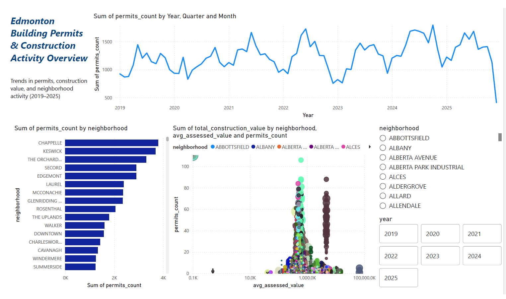
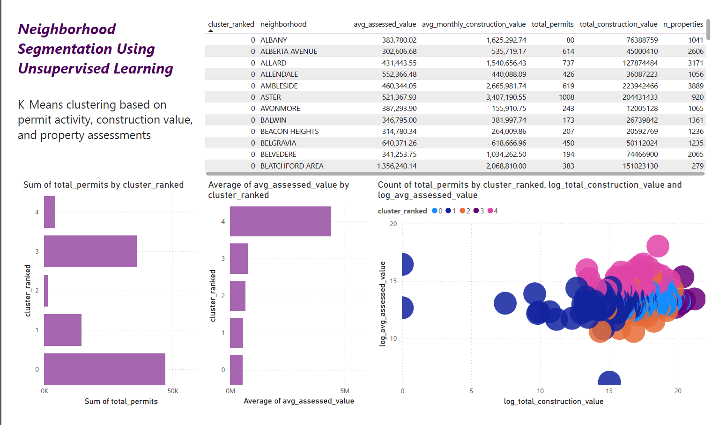
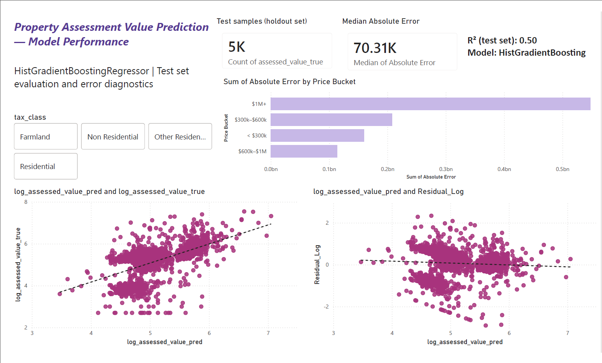

# Edmonton Urban Analytics & Property Value Modeling

End-to-end data analytics and machine learning project analyzing urban development patterns in Edmonton and predicting residential property assessed values using permit activity and location-based features.

## Project Overview
This project integrates **SQL, Python, Machine Learning, and Power BI** to:
- Analyze building permit trends at the neighborhood level
- Cluster neighborhoods by development intensity and value
- Predict property assessed values using permit and spatial features
- Communicate insights through interactive Power BI dashboards

## Data Sources
City of Edmonton Open Data:
- Building Permits (2019–2025)
- Property Assessment Data (2025)

## Tech Stack
- **SQL (SQLite)** – data modeling, aggregation, analytical views  
- **Python** – pandas, NumPy, scikit-learn  
- **Machine Learning** – KMeans, HistGradientBoostingRegressor, Random Forest  
- **Visualization** – Power BI  
- **Version Control** – Git & GitHub  

## Analytics & Machine Learning

### Data Engineering
- Cleaned and normalized raw CSV datasets
- Built relational tables and analytical SQL views
- Engineered neighborhood-level and property-level features

### Neighborhood Clustering
- KMeans clustering on development and valuation metrics
- Log-transformed skewed features to handle outliers
- Identified distinct neighborhood development profiles

### Property Value Prediction
- Target: `log(assessed_value)`
- Model: **HistGradientBoostingRegressor**
- Key features:
  - Latitude / longitude
  - Permit activity aggregates
  - Tax class, ward, neighborhood identifiers
- Performance (test set):
  - R² ≈ 0.50 (log scale)
  - Approx. MAE ≈ $200K (back-transformed)
- Large dataset handled via stratified sampling (32-bit Python safe)

### Permit Forecasting by Cluster
- Aggregated monthly permits by neighborhood cluster
- Created lag features (t-1, t-2)
- Random Forest regression with time-aware train/test split
- Forecasted next-month permit volume per cluster

## Power BI Dashboards
Three interactive pages:
1. **Urban Development Overview**
2. **Neighborhood Clusters**
3. **Property Value Model Performance**
   - Residual analysis
   - Error by price bucket
   - KPI cards (R², MAE, test samples)
   - Interactive slicers (neighborhood, tax class, ward)

## 📸 Dashboards & Visual Outputs

### Urban Development Overview

### Neighborhood Clustering

### Property Value Model Performance

